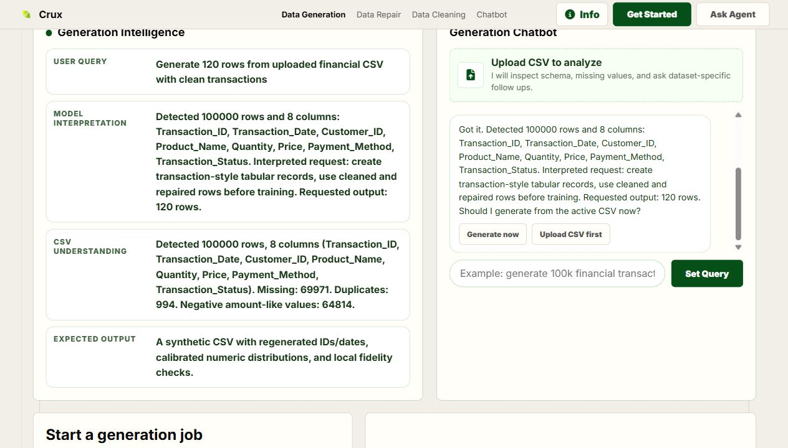

# Crux Desktop

Installable local-first desktop app for cleaning, repairing, and generating financial CSV datasets.



## What It Does

Crux Desktop wraps the full Crux web interface in a PySide6 app. It starts a bundled local FastAPI engine, detects local Ollama models, and runs CSV workflows on the user's machine.

- No external API is required for core workflows.
- Local Ollama models are used for contextual repair.
- CTGAN generates synthetic tabular data locally.
- Runtime logs stay visible in the desktop shell.
- Data generation, repair, and cleaning all export downloadable CSV files.

Author: **Kartikeya Krishna Mishra**

## Folder Structure

```text
app/
  desktop_launcher.py        PySide6 desktop shell and local engine launcher
  bundled_web/               Independent bundled Crux web/backend app
  model_catalog.json         Ollama/model choices shown in setup
  installer/                 Inno Setup script and installer notes
  docs/assets/               README screenshots
  verification/              Local verification outputs, ignored by git
  Crux.spec                  PyInstaller build spec
  build_installer.ps1        Repeatable Windows build script
  requirements.txt           Desktop + bundled engine dependencies
```

`app/bundled_web` is intentionally independent from `../web`. The desktop app should keep working even if the web repository is moved elsewhere.

## Run From Source

```powershell
cd app
python -m venv .venv
.\.venv\Scripts\Activate.ps1
python -m pip install --upgrade pip
python -m pip install -r requirements.txt
python desktop_launcher.py
```

Recommended local model:

```powershell
ollama pull llama3
```

## Verify

From the parent workspace:

```powershell
python app\desktop_launcher.py --self-test
python app\verify_features.py C:\Users\USER\Downloads\dirty_financial_transactions.csv
```

The verifier checks real CSV transformations:

- cleaning removes missing values and duplicates
- repair fixes missing values, duplicates, and negative amount-like fields
- generation trains CTGAN on repaired data
- chatbot-style generation creates the requested row count
- generated IDs are regenerated and missing/negative values are checked

## Build Portable Windows App

PyInstaller is used for the desktop build.

```powershell
cd app
.\build_installer.ps1
```

Outputs:

```text
app/dist/Crux/                 Portable app folder
app/release/Crux-portable-windows.zip
```

## Build Inno Setup Installer

Install Inno Setup, then rerun:

```powershell
cd app
.\build_installer.ps1
```

If `ISCC.exe` is available on `PATH`, the script also creates:

```text
app/release/CruxSetup-0.1.0.exe
```

The installer script is:

```text
app/installer/crux.iss
```

## GitHub Notes

This folder is ready to push as its own repository. Runtime outputs, build artifacts, virtual environments, and verification CSVs are ignored by `.gitignore`.
